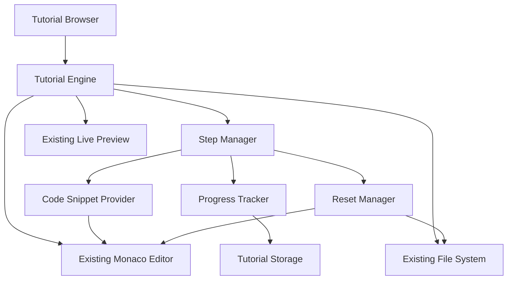

# Design Document

## Overview

The guided tutorial system transforms WebForge from a traditional IDE-style editor into an interactive, step-by-step learning platform inspired by CodeDex. The system focuses on component-based learning where students build real website elements (navbars, footers, hero sections, cards, forms) through carefully structured tutorials that emphasize manual typing, immediate visual feedback, and progressive skill building.

The platform maintains WebForge's existing technical foundation (vanilla JavaScript, Monaco Editor, localStorage) while introducing a new tutorial orchestration layer that guides students through bite-sized coding exercises. Each tutorial is broken into small steps that build upon each other, with students manually typing code snippets and seeing immediate results in the live preview.

## Architecture

### High-Level Architecture

The tutorial system extends WebForge's existing architecture with new tutorial-specific components:



### Component Integration

The tutorial system integrates with existing WebForge components:

- **Monaco Editor**: Enhanced with tutorial-specific highlighting and guided input areas
- **Live Preview**: Maintains real-time updates with tutorial-specific result highlighting
- **File System**: Extended to support tutorial templates and step-based file states
- **Storage Service**: Expanded to track tutorial progress and step completion

### Technology Stack

Maintains WebForge's existing stack with additions:
- **Core**: Vanilla JavaScript (ES6+), HTML5, CSS3
- **Editor**: Monaco Editor (existing)
- **Storage**: localStorage (existing) + tutorial progress tracking
- **New Components**: Tutorial engine, step manager, progress tracker
- **Testing**: Property-based testing with existing framework

## Components and Interfaces

### 1. Tutorial Engine

**Responsibilities:**
- Load and manage tutorial content
- Orchestrate step progression
- Coordinate with existing editor and preview components
- Handle tutorial state management

**Interface:**
```javascript
class TutorialEngine {
  loadTutorial(tutorialId) { /* Load tutorial definition */ }
  startTutorial(tutorialId, mode) { /* Start in tutorial or project mode */ }
  nextStep() { /* Advance to next step */ }
  resetCurrentStep() { /* Reset current step to starting state */ }
  getCurrentStep() { /* Get current step information */ }
  getTutorialProgress() { /* Get completion status */ }
}

const TutorialDefinition = {
  id: 'navbar-basic',
  title: 'Build a Navigation Bar',
  category: 'Navigation',
  difficulty: 'beginner',
  estimatedTime: '15 minutes',
  finalPreview: 'path/to/preview.png',
  steps: [/* Array of TutorialStep objects */]
};
```

### 2. Step Manager

**Responsibilities:**
- Manage individual tutorial steps
- Provide code snippets and instructions
- Track step completion
- Handle step validation

**Interface:**
```javascript
class StepManager {
  getCurrentStepData() { /* Get current step information */ }
  validateStepCompletion() { /* Check if step requirements met */ }
  provideHint() { /* Provide help for stuck students */ }
  insertCompletedCode() { /* Fallback code insertion */ }
}

const TutorialStep = {
  id: 'step-1',
  title: 'Add HTML structure',
  goal: 'Create the basic navigation container',
  targetFile: 'index.html',
  targetLocation: 'body',
  codeSnippet: '<nav class="navbar">\n  <!-- Navigation content -->\n</nav>',
  explanation: 'The nav element provides semantic structure for navigation',
  validation: { /* Validation rules */ },
  hint: 'Remember to add the nav element inside the body tag'
};
```

### 3. Tutorial Browser

**Responsibilities:**
- Display available tutorials by category
- Show tutorial previews and metadata
- Handle tutorial selection
- Track completion status

**Interface:**
```javascript
class TutorialBrowser {
  getTutorialsByCategory() { /* Get tutorials grouped by category */ }
  searchTutorials(query) { /* Search tutorials by keyword */ }
  getTutorialPreview(tutorialId) { /* Get tutorial preview data */ }
  getCompletionStatus() { /* Get user's tutorial completion status */ }
}

const TutorialCategory = {
  id: 'layout',
  name: 'Layout',
  description: 'Learn to create page layouts and structure',
  tutorials: [/* Array of tutorial IDs */]
};
```

### 4. Progress Tracker

**Responsibilities:**
- Track step and tutorial completion
- Manage progress persistence
- Provide progress visualization
- Handle tutorial unlocking logic

**Interface:**
```javascript
class ProgressTracker {
  markStepComplete(tutorialId, stepId) { /* Mark step as completed */ }
  markTutorialComplete(tutorialId) { /* Mark tutorial as completed */ }
  getProgress(tutorialId) { /* Get tutorial progress */ }
  getOverallProgress() { /* Get all tutorial progress */ }
  getNextSuggestedTutorial(completedTutorialId) { /* Suggest next tutorial */ }
}

const ProgressData = {
  tutorialId: 'navbar-basic',
  completedSteps: ['step-1', 'step-2'],
  totalSteps: 6,
  completed: false,
  completedAt: null
};
```

### 5. Reset Manager

**Responsibilities:**
- Handle step and tutorial resets
- Restore file states to step starting points
- Preserve progress on completed steps
- Manage tutorial state snapshots

**Interface:**
```javascript
class ResetManager {
  resetCurrentStep() { /* Reset current step to starting state */ }
  resetTutorial() { /* Reset entire tutorial */ }
  createStepSnapshot() { /* Save current state before step */ }
  restoreStepSnapshot(stepId) { /* Restore to step starting state */ }
}
```

## Data Models

### Tutorial Data Model

```javascript
const Tutorial = {
  id: 'navbar-responsive',                    // Unique tutorial identifier
  title: 'Build a Responsive Navigation',    // Display title
  category: 'Navigation',                     // Category for grouping
  difficulty: 'intermediate',                 // beginner, intermediate, advanced
  estimatedTime: '20 minutes',              // Estimated completion time
  description: 'Learn to create a mobile-friendly navigation bar',
  prerequisites: ['navbar-basic'],           // Required completed tutorials
  finalPreview: 'assets/navbar-preview.png', // Preview of final result
  steps: [/* Array of TutorialStep objects */],
  unlocksTutorials: ['dropdown-menu']        // Tutorials unlocked by completion
};
```

### Tutorial Step Data Model

```javascript
const TutorialStep = {
  id: 'step-3',                             // Unique step identifier
  title: 'Add CSS styling',                 // Step title
  goal: 'Style the navigation with flexbox', // One-sentence goal
  targetFile: 'styles.css',                // File to edit
  targetLocation: '/* Navigation styles */', // Where to add code
  codeSnippet: `.navbar {
  display: flex;
  justify-content: space-between;
  padding: 1rem;
}`,                                         // Code to type
  explanation: 'Flexbox makes it easy to align navigation items', // Optional brief explanation
  validation: {                             // Validation rules
    type: 'css-property',
    selector: '.navbar',
    property: 'display',
    value: 'flex'
  },
  hint: 'Use display: flex to make the navbar a flex container',
  fallbackCode: '/* Complete CSS code if student gets stuck */'
};
```

### Tutorial Category Data Model

```javascript
const TutorialCategory = {
  id: 'ui-components',                      // Category identifier
  name: 'UI Components',                    // Display name
  description: 'Build reusable interface elements', // Category description
  icon: 'components-icon',                  // Icon identifier
  order: 3,                                // Display order
  tutorials: ['card-basic', 'button-styles', 'modal-popup'] // Tutorial IDs
};
```

### Progress Data Model

```javascript
const UserProgress = {
  userId: 'student-123',                    // User identifier (if applicable)
  tutorials: {                             // Tutorial progress map
    'navbar-basic': {
      started: true,
      completedSteps: ['step-1', 'step-2', 'step-3'],
      totalSteps: 6,
      completed: false,
      startedAt: '2024-01-15T10:00:00Z',
      lastAccessedAt: '2024-01-15T10:30:00Z'
    }
  },
  unlockedTutorials: ['navbar-basic', 'hero-section'], // Available tutorials
  completedTutorials: [],                  // Fully completed tutorials
  currentTutorial: 'navbar-basic',         // Currently active tutorial
  currentStep: 'step-4'                    // Current step in active tutorial
};
```

## Correctness Properties

*A property is a characteristic or behavior that should hold true across all valid executions of a system—essentially, a formal statement about what the system should do. Properties serve as the bridge between human-readable specifications and machine-verifiable correctness guarantees.*

### Property Reflection

After reviewing all properties identified in the prework, several can be consolidated to eliminate redundancy:

**Consolidations:**
- Properties 1.2 and 9.1 both test goal description length limits - combine into single property
- Properties 2.4 and 4.4 both test fallback code explanation - combine into single property  
- Properties 3.4 and 9.4 both test error message quality - combine into single property
- Properties 4.5 and 9.4 both test beginner-friendly error messages - combine into single property
- Properties 9.2, 9.3, and 9.5 all test explanation quality - combine into single comprehensive property

**Unique Properties Retained:**
Each remaining property provides distinct validation value for different aspects of the tutorial system.

### Property 1: Tutorial step display structure
*For any* tutorial, when displayed, it should show numbered steps with clear progress indication
**Validates: Requirements 1.1**

### Property 2: Step goal sentence limit
*For any* tutorial step, the goal description should be one sentence or less
**Validates: Requirements 1.2, 9.1**

### Property 3: Code snippet size constraint
*For any* tutorial step with code, the code snippet should be between 1-10 lines maximum
**Validates: Requirements 1.3, 2.1**

### Property 4: Preview update timing
*For any* code completion in a tutorial step, the live preview should update within 2 seconds
**Validates: Requirements 1.4, 3.1**

### Property 5: Step progression automation
*For any* completed tutorial step, the platform should automatically advance to the next step and update progress
**Validates: Requirements 1.5**

### Property 6: Code location labeling
*For any* code snippet provided, it should include clear location labels indicating where to place the code
**Validates: Requirements 2.2**

### Property 7: Editor focus behavior
*For any* code typing activity, the platform should highlight or focus the exact file and line location for editing
**Validates: Requirements 2.3**

### Property 8: Fallback code availability and explanation
*For any* tutorial step, an optional "Insert completed version" button should be available, and when used, should provide explanation of what was added
**Validates: Requirements 2.4, 4.4**

### Property 9: CSS and JavaScript preview updates
*For any* CSS or JavaScript code changes, the live preview should show the changes immediately
**Validates: Requirements 3.2, 3.3**

### Property 10: Error handling with fallback state
*For any* code containing errors, the preview should display the last working state and show beginner-friendly error messages
**Validates: Requirements 3.4, 9.4**

### Property 11: Visual change highlighting
*For any* successfully completed step, the platform should highlight the visual change that was accomplished
**Validates: Requirements 3.5**

### Property 12: Step reset functionality
*For any* tutorial step, clicking reset should restore the step to its starting state while preserving progress on previous steps
**Validates: Requirements 4.1, 4.2**

### Property 13: Hint provision without solution revelation
*For any* tutorial step, hints should be available that provide guidance without revealing the complete solution
**Validates: Requirements 4.3**

### Property 14: Progress visualization
*For any* active tutorial, a step counter should display current position, and completed steps should be marked visually
**Validates: Requirements 5.1, 5.2**

### Property 15: Tutorial completion and suggestions
*For any* finished tutorial, it should be marked as completed and suggest the next related tutorial
**Validates: Requirements 5.3, 5.4**

### Property 16: Tutorial list completion status
*For any* tutorial in browsing lists, completion status should be displayed
**Validates: Requirements 5.5**

### Property 17: Tutorial categorization and metadata
*For any* tutorial browser display, tutorials should be grouped by categories and show component descriptions, difficulty, and estimated time
**Validates: Requirements 6.1, 6.2, 6.4**

### Property 18: Tutorial preview display
*For any* selected tutorial, a preview of the final result should be displayed before starting
**Validates: Requirements 6.3**

### Property 19: Tutorial unlocking logic
*For any* completed tutorial, related or more advanced tutorials should be unlocked
**Validates: Requirements 6.5**

### Property 20: Tutorial mode options
*For any* tutorial start, options should be offered to practice in dedicated tutorial space or within existing project
**Validates: Requirements 7.1**

### Property 21: Project mode integration
*For any* tutorial practiced in project mode, guidance should be provided for component integration, and completed components should be preserved in the project
**Validates: Requirements 7.2, 7.3**

### Property 22: Project mode guidance preservation
*For any* tutorial in project mode, tutorial guidance should be maintained while respecting existing project code
**Validates: Requirements 7.4**

### Property 23: Mode switching with progress preservation
*For any* tutorial, switching between tutorial and project modes should preserve progress and allow resuming
**Validates: Requirements 7.5**

### Property 24: Export completeness with components
*For any* project export containing tutorial work, the ZIP file should include all HTML, CSS, and JavaScript files with completed components, organized in logical structure
**Validates: Requirements 8.1, 8.2, 8.4**

### Property 25: Export documentation and functionality preservation
*For any* tutorial work export, a README file should be included explaining components and hosting instructions, and all functionality should be preserved
**Validates: Requirements 8.3, 8.5**

### Property 26: Beginner-friendly content quality
*For any* explanations, code examples, and instructions, they should use simple language, be brief and actionable, and focus on practical application rather than theory
**Validates: Requirements 9.2, 9.3, 9.5**

### Property 27: Clean interface design
*For any* tutorial interface display, it should show clean layout with readable text, minimize advanced features during tutorials, and provide clear visual indicators without clutter
**Validates: Requirements 10.1, 10.2, 10.3**

### Property 28: Code display and interaction feedback
*For any* code area display, adequate spacing and contrast should be provided, and all tutorial interactions should provide immediate visual feedback
**Validates: Requirements 10.4, 10.5**

## Error Handling

### Tutorial Loading Errors

- **Missing Tutorial Data**: Display friendly message and suggest alternative tutorials
- **Corrupted Tutorial Steps**: Attempt to load individual steps, skip corrupted ones with notification
- **Invalid Tutorial Format**: Validate tutorial structure on load, provide fallback content

### Step Execution Errors

- **Code Validation Failures**: Show specific error location with beginner-friendly explanation
- **Preview Rendering Errors**: Maintain last working state, display error in separate panel
- **File Operation Errors**: Retry with exponential backoff, offer manual recovery options

### Progress Tracking Errors

- **Storage Failures**: Queue progress updates locally, sync when storage available
- **Progress Corruption**: Attempt recovery from backup, offer to restart tutorial if needed
- **Sync Conflicts**: Use last-write-wins strategy with user notification

### Reset and Recovery Errors

- **Reset Failures**: Attempt multiple recovery strategies, offer manual file restoration
- **State Corruption**: Provide clean slate option while preserving completed tutorials
- **Snapshot Errors**: Create multiple backup points, use most recent valid state

## Testing Strategy

### Unit Testing

Unit tests will verify specific tutorial behaviors and edge cases:

- Tutorial loading and parsing with various tutorial formats
- Step validation with different code snippet types
- Progress tracking with various completion scenarios
- Reset functionality with different tutorial states
- Error handling with specific error conditions
- Export functionality with tutorial-enhanced projects

### Property-Based Testing

Property-based tests will verify universal properties using **fast-check** (JavaScript property testing library):

- Each property test will run a minimum of 100 iterations with randomly generated inputs
- Each test will include a comment tag in the format: `**Feature: guided-tutorial-system, Property {number}: {property_text}**`
- Tests will generate random tutorials, steps, and user interactions to verify properties hold across all valid inputs

**Property Test Coverage:**

1. Tutorial display structure across all tutorial types
2. Step goal sentence limits across all steps
3. Code snippet size constraints across all code types
4. Preview update timing across all code changes
5. Step progression across all tutorial flows
6. Code location labeling across all snippet types
7. Editor focus behavior across all file types
8. Fallback code functionality across all steps
9. Preview updates for CSS and JavaScript changes
10. Error handling with various error types
11. Visual change highlighting across all step completions
12. Reset functionality across all tutorial states
13. Hint provision across all step types
14. Progress visualization across all tutorial types
15. Tutorial completion and suggestion logic
16. Tutorial list status display
17. Tutorial categorization and metadata display
18. Tutorial preview functionality
19. Tutorial unlocking logic across completion scenarios
20. Tutorial mode options across all tutorials
21. Project mode integration across various project states
22. Project mode guidance preservation
23. Mode switching with progress preservation
24. Export completeness with tutorial components
25. Export documentation and functionality preservation
26. Content quality across all tutorial content
27. Interface design consistency across all displays
28. Code display and interaction feedback

### Integration Testing

- End-to-end tutorial completion workflows
- Tutorial browser to step execution flow
- Project mode integration with existing WebForge features
- Export functionality with tutorial-enhanced projects
- Progress tracking across browser sessions
- Reset and recovery across various failure scenarios

### User Experience Testing

- Tutorial pacing and difficulty progression
- Code snippet size and complexity appropriateness
- Error message clarity and helpfulness
- Interface responsiveness during tutorial execution
- Progress visualization effectiveness

## Performance Considerations

- **Lazy Tutorial Loading**: Load tutorial content only when selected to reduce initial load time
- **Step Caching**: Cache tutorial steps to avoid repeated parsing and validation
- **Progress Debouncing**: Batch progress updates to reduce storage operations
- **Preview Optimization**: Maintain existing WebForge preview debouncing (500ms) for tutorial code changes
- **Memory Management**: Clean up tutorial state when switching between tutorials

## Security Considerations

- **Code Execution Sandboxing**: Maintain existing WebForge iframe sandboxing for tutorial code execution
- **Tutorial Content Validation**: Validate tutorial definitions to prevent malicious code injection
- **Progress Data Integrity**: Validate progress data to prevent manipulation
- **File System Isolation**: Ensure tutorial operations don't affect non-tutorial files inappropriately

## Accessibility

- **Keyboard Navigation**: Full keyboard support for tutorial navigation and step progression
- **Screen Reader Support**: ARIA labels for tutorial progress, step indicators, and code areas
- **High Contrast Support**: Ensure tutorial interface works with high contrast modes
- **Focus Management**: Clear focus indicators for tutorial controls and code editing areas
- **Alternative Text**: Provide alt text for tutorial preview images and visual indicators

## Integration with Existing WebForge

### Maintained Components

- **Monaco Editor**: Enhanced with tutorial-specific highlighting and guided input
- **Live Preview**: Maintains real-time updates with tutorial-specific result highlighting
- **File System**: Extended to support tutorial templates and step-based file states
- **Storage Service**: Expanded to track tutorial progress and step completion
- **Export Functionality**: Enhanced to include tutorial-built components and documentation

### New Components

- **Tutorial Engine**: Core orchestration of tutorial flow
- **Tutorial Browser**: Category-based tutorial selection interface
- **Step Manager**: Individual step execution and validation
- **Progress Tracker**: Visual progress indication and completion tracking
- **Reset Manager**: Step and tutorial reset functionality

### Backward Compatibility

- Existing WebForge projects remain fully functional
- Tutorial system operates as an additional mode alongside existing free-form editing
- All existing export and storage functionality preserved
- Existing templates can be enhanced with tutorial versions

## Future Enhancements

- **Advanced Tutorial Types**: Interactive quizzes, drag-and-drop exercises
- **Community Tutorials**: User-generated tutorial content with moderation
- **Adaptive Difficulty**: Dynamic tutorial difficulty based on student performance
- **Collaboration Features**: Shared tutorial progress and peer assistance
- **Analytics Integration**: Learning analytics to improve tutorial effectiveness
- **Mobile Optimization**: Touch-optimized tutorial interface for mobile devices
- **Offline Support**: Cached tutorials for offline learning
- **Achievement System**: Optional gamification elements for motivation