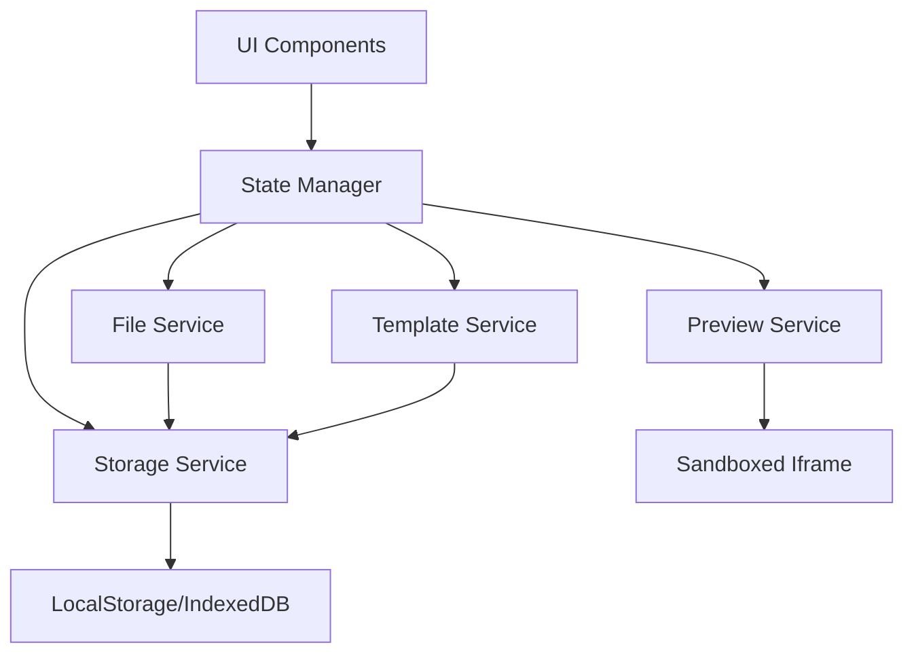

# Design Document

## Overview

The student website builder is a single-page web application that provides an integrated development environment (IDE) in the browser. The platform enables students to learn web development through hands-on practice by writing HTML, CSS, and JavaScript code and seeing immediate visual feedback. The system consists of a code editor, live preview renderer, file management system, template library, and integrated learning resources.

The application runs entirely in the browser using modern web technologies, with local storage for persistence and optional cloud sync capabilities. The architecture prioritizes simplicity, immediate feedback, and a low barrier to entry for students new to web development.

## Architecture

### High-Level Architecture

The application follows a client-side architecture with the following layers:

1. **Presentation Layer**: React-based UI components for the editor, preview, file tree, and learning panels
2. **Application Layer**: State management (using Redux or Zustand) coordinating editor state, file system, and preview updates
3. **Service Layer**: Core services for file operations, code execution, template management, and storage
4. **Storage Layer**: Browser LocalStorage/IndexedDB for persistence, with optional cloud backup

### Component Interaction Flow



### Technology Stack

- **Frontend Framework**: React with TypeScript
- **State Management**: Zustand (lightweight, simple API suitable for educational context)
- **Code Editor**: Monaco Editor (VS Code's editor, provides syntax highlighting and error detection)
- **Styling**: Tailwind CSS for responsive design
- **Build Tool**: Vite for fast development and optimized builds
- **Storage**: LocalStorage for small data, IndexedDB for larger projects
- **Testing**: Vitest for unit tests, fast-check for property-based testing

## Components and Interfaces

### 1. Editor Component

**Responsibilities:**
- Display code with syntax highlighting
- Handle user input and editing
- Show line numbers and basic formatting
- Highlight syntax errors
- Emit change events to update file contents

**Interface:**
```typescript
interface EditorProps {
  fileId: string;
  content: string;
  language: 'html' | 'css' | 'javascript';
  onChange: (content: string) => void;
  onSave: () => void;
}

interface EditorError {
  line: number;
  column: number;
  message: string;
  severity: 'error' | 'warning';
}
```

### 2. Preview Component

**Responsibilities:**
- Render student's HTML, CSS, and JavaScript in isolated environment
- Update display when code changes
- Capture and display runtime errors
- Provide sandboxed execution context

**Interface:**
```typescript
interface PreviewProps {
  projectId: string;
  files: ProjectFile[];
  onError: (error: RuntimeError) => void;
}

interface RuntimeError {
  message: string;
  stack?: string;
  line?: number;
  file?: string;
}
```

### 3. File Service

**Responsibilities:**
- Create, read, update, and delete project files
- Manage file hierarchy
- Validate file names and types
- Handle file import/export

**Interface:**
```typescript
interface FileService {
  createFile(projectId: string, name: string, type: FileType): Promise<ProjectFile>;
  readFile(fileId: string): Promise<ProjectFile>;
  updateFile(fileId: string, content: string): Promise<void>;
  deleteFile(fileId: string): Promise<void>;
  renameFile(fileId: string, newName: string): Promise<void>;
  listFiles(projectId: string): Promise<ProjectFile[]>;
}

interface ProjectFile {
  id: string;
  projectId: string;
  name: string;
  type: FileType;
  content: string;
  createdAt: Date;
  updatedAt: Date;
}

type FileType = 'html' | 'css' | 'javascript' | 'asset';
```

### 4. Project Service

**Responsibilities:**
- Create and manage projects
- Apply templates to projects
- Export projects as ZIP files
- Handle project metadata

**Interface:**
```typescript
interface ProjectService {
  createProject(name: string, templateId?: string): Promise<Project>;
  getProject(projectId: string): Promise<Project>;
  deleteProject(projectId: string): Promise<void>;
  listProjects(): Promise<Project[]>;
  exportProject(projectId: string): Promise<Blob>;
}

interface Project {
  id: string;
  name: string;
  createdAt: Date;
  updatedAt: Date;
  files: ProjectFile[];
}
```

### 5. Template Service

**Responsibilities:**
- Provide available templates
- Load template contents
- Apply templates to projects

**Interface:**
```typescript
interface TemplateService {
  listTemplates(): Promise<Template[]>;
  getTemplate(templateId: string): Promise<Template>;
  applyTemplate(projectId: string, templateId: string): Promise<void>;
}

interface Template {
  id: string;
  name: string;
  description: string;
  category: 'portfolio' | 'blog' | 'landing' | 'business';
  previewImage: string;
  files: TemplateFile[];
}

interface TemplateFile {
  name: string;
  type: FileType;
  content: string;
}
```

### 6. Storage Service

**Responsibilities:**
- Persist projects and files to browser storage
- Handle auto-save operations
- Manage storage quota
- Sync with cloud storage (optional)

**Interface:**
```typescript
interface StorageService {
  save(key: string, data: any): Promise<void>;
  load(key: string): Promise<any>;
  delete(key: string): Promise<void>;
  clear(): Promise<void>;
  getStorageInfo(): Promise<StorageInfo>;
}

interface StorageInfo {
  used: number;
  available: number;
  percentage: number;
}
```

## Data Models

### Project Data Model

```typescript
interface Project {
  id: string;                    // UUID
  name: string;                  // User-defined project name
  createdAt: Date;              // Creation timestamp
  updatedAt: Date;              // Last modification timestamp
  files: ProjectFile[];         // Array of project files
}
```

### File Data Model

```typescript
interface ProjectFile {
  id: string;                    // UUID
  projectId: string;            // Reference to parent project
  name: string;                 // File name with extension
  type: FileType;               // File type enum
  content: string;              // File contents as string
  createdAt: Date;              // Creation timestamp
  updatedAt: Date;              // Last modification timestamp
}

type FileType = 'html' | 'css' | 'javascript' | 'asset';
```

### Template Data Model

```typescript
interface Template {
  id: string;                    // UUID
  name: string;                  // Template display name
  description: string;           // Template description
  category: TemplateCategory;    // Template category
  previewImage: string;          // URL or base64 preview image
  files: TemplateFile[];        // Template file contents
}

type TemplateCategory = 'portfolio' | 'blog' | 'landing' | 'business';

interface TemplateFile {
  name: string;                  // File name with extension
  type: FileType;               // File type
  content: string;              // File contents
}
```

### Tutorial Data Model

```typescript
interface Tutorial {
  id: string;                    // UUID
  title: string;                 // Tutorial title
  topic: TutorialTopic;         // Tutorial topic category
  steps: TutorialStep[];        // Array of tutorial steps
}

type TutorialTopic = 'html-basics' | 'css-styling' | 'javascript-fundamentals' | 'responsive-design';

interface TutorialStep {
  id: string;                    // UUID
  title: string;                 // Step title
  content: string;              // Step instructions (markdown)
  codeExample?: string;         // Optional code example
  completed: boolean;           // Completion status
}
```

## Correctness Properties

*A property is a characteristic or behavior that should hold true across all valid executions of a system—essentially, a formal statement about what the system should do. Properties serve as the bridge between human-readable specifications and machine-verifiable correctness guarantees.*

### Property 1: Project creation initializes with default files

*For any* new project created without a template, the project should contain exactly three default files: index.html, styles.css, and script.js
**Validates: Requirements 1.1**

### Property 2: Project unique identifiers

*For any* set of created projects, each project should have a unique identifier and a valid timestamp
**Validates: Requirements 1.2**

### Property 3: Project appears in workspace after creation

*For any* newly created project, the project should appear in the workspace's project list
**Validates: Requirements 1.3**

### Property 4: Template application copies all files

*For any* template applied to a project, all files from the template should be present in the project after application
**Validates: Requirements 1.5, 5.3**

### Property 5: Editor updates reflect in file content

*For any* text entered in the editor, the underlying file content should be updated to match the editor content
**Validates: Requirements 2.2**

### Property 6: File content persistence round-trip

*For any* file content saved to storage, loading that file should return identical content
**Validates: Requirements 2.3, 6.2**

### Property 7: Syntax errors don't block editing

*For any* code with syntax errors entered in the editor, the editor should continue accepting further input without blocking
**Validates: Requirements 2.5**

### Property 8: Preview reflects current file state

*For any* set of project files, the preview should render using the most recent content of all files
**Validates: Requirements 3.2**

### Property 9: File creation adds to project

*For any* file created with a valid name and type, the file should be added to the project and appear in the file list
**Validates: Requirements 4.1**

### Property 10: File deletion removes from project

*For any* file in a project, deleting that file should result in the file no longer appearing in the project's file list
**Validates: Requirements 4.2**

### Property 11: File rename preserves content

*For any* file with content, renaming the file should preserve its content exactly while updating only the file name
**Validates: Requirements 4.3**

### Property 12: File click opens in editor

*For any* file in the workspace, clicking on it should load that file's content in the editor
**Validates: Requirements 4.5**

### Property 13: Template categories are assigned

*For any* template in the system, the template should have a valid category assigned from the defined category types
**Validates: Requirements 5.4**

### Property 14: Template application preserves non-conflicting files

*For any* project with existing files, applying a template should preserve all existing files whose names don't conflict with template files
**Validates: Requirements 5.5**

### Property 15: Storage quota warning prevents data loss

*For any* save operation that would exceed available storage, the system should notify the user before attempting the save and prevent data loss
**Validates: Requirements 6.3**

### Property 16: Export includes all project files

*For any* project, exporting should produce a ZIP file containing all files in the project with their current content
**Validates: Requirements 7.1**

### Property 17: Export preserves folder structure

*For any* project with a folder structure, the exported ZIP file should maintain the same folder hierarchy
**Validates: Requirements 7.4**

### Property 18: HTML error messages include line numbers

*For any* HTML syntax error, the error message should include the line number where the error occurred
**Validates: Requirements 8.1**

### Property 19: CSS error detection highlights invalid properties

*For any* CSS with invalid properties, the system should detect and highlight the problematic rules
**Validates: Requirements 8.2**

### Property 20: JavaScript runtime errors are captured

*For any* JavaScript runtime error, the system should capture and display the error message and stack trace
**Validates: Requirements 8.3**

### Property 21: Tutorials are organized by topic

*For any* set of tutorials, they should be grouped by their topic category
**Validates: Requirements 9.1**

### Property 22: Tutorials contain steps and examples

*For any* tutorial, it should contain at least one step with instructions, and steps may include code examples
**Validates: Requirements 9.2**

### Property 23: Code examples can be copied to editor

*For any* tutorial code example, there should be a function to copy that code to the editor
**Validates: Requirements 9.3**

### Property 24: Tutorial step completion advances progress

*For any* tutorial step marked as complete, the tutorial progress should update and advance to the next step if available
**Validates: Requirements 9.4**

### Property 25: Responsive layout adapts to screen width

*For any* screen width, the layout should adapt appropriately: single-column for mobile (<768px), stacked for tablet (768-1024px), and side-by-side for desktop (>1024px)
**Validates: Requirements 10.1, 10.2, 10.3**

## Error Handling

### Editor Errors

- **Syntax Errors**: Highlight in editor with line/column information, display beginner-friendly messages
- **Runtime Errors**: Capture in preview iframe, display in console panel with stack trace
- **Save Errors**: Show notification, retry with exponential backoff, fall back to download if storage fails

### Storage Errors

- **Quota Exceeded**: Notify user, offer to delete old projects or export current work
- **Corruption**: Attempt recovery from backup, offer to start fresh if recovery fails
- **Sync Failures**: Queue changes locally, retry when connection restored

### Preview Errors

- **Infinite Loops**: Timeout JavaScript execution after 5 seconds, display warning
- **Security Violations**: Block and explain CSP violations or dangerous operations
- **Resource Loading**: Handle missing assets gracefully, show placeholder

### File Operation Errors

- **Invalid Names**: Validate before operation, show specific error (e.g., "File name cannot be empty")
- **Duplicate Names**: Prevent creation, suggest alternative name
- **Missing Files**: Handle gracefully, remove from project if permanently lost

## Testing Strategy

### Unit Testing

Unit tests will verify specific examples and edge cases:

- File service CRUD operations with various file types
- Project creation with and without templates
- Storage service quota management
- Error message formatting for common syntax errors
- ZIP file generation with different project structures
- Tutorial step completion tracking

### Property-Based Testing

Property-based tests will verify universal properties using **fast-check** (JavaScript/TypeScript property testing library):

- Each property test will run a minimum of 100 iterations with randomly generated inputs
- Each test will include a comment tag in the format: `**Feature: student-website-builder, Property {number}: {property_text}**`
- Tests will generate random projects, files, and operations to verify properties hold across all valid inputs

**Property Test Coverage:**

1. Project creation always initializes with required default files
2. File content round-trips through save/load without modification
3. File operations (create/update/delete/rename) maintain project consistency
4. Template application preserves non-conflicting files
5. Preview rendering uses current file state
6. Export includes all project files with correct content
7. Auto-save and restore preserves editor state
8. File deletion removes file from project
9. File rename preserves content
10. Invalid file names are rejected
11. Syntax errors don't block editing
12. Storage quota warnings prevent data loss

### Integration Testing

- End-to-end workflows: create project → edit files → preview → export
- Template application and customization flow
- Auto-save and recovery after simulated browser close
- Multi-file project with HTML/CSS/JS interactions

### Browser Compatibility Testing

- Test on Chrome, Firefox, Safari, Edge
- Verify LocalStorage and IndexedDB behavior
- Test responsive layouts on different screen sizes
- Verify touch interactions on mobile devices

## Performance Considerations

- **Debounce Preview Updates**: Wait 500ms after last edit before updating preview
- **Lazy Load Templates**: Load template content only when selected
- **Virtual Scrolling**: For file lists with many files
- **Code Splitting**: Load Monaco Editor and other large dependencies on demand
- **IndexedDB for Large Projects**: Use IndexedDB instead of LocalStorage for projects >5MB

## Security Considerations

- **Sandbox Preview**: Use iframe with sandbox attribute to isolate student code
- **Content Security Policy**: Restrict preview iframe capabilities
- **Input Sanitization**: Sanitize file names and project names
- **Storage Limits**: Enforce per-project size limits to prevent abuse
- **No Server Execution**: All code runs client-side only

## Accessibility

- **Keyboard Navigation**: Full keyboard support for editor, file tree, and UI controls
- **Screen Reader Support**: ARIA labels for all interactive elements
- **High Contrast Mode**: Support system high contrast preferences
- **Focus Management**: Clear focus indicators and logical tab order
- **Resizable Panels**: Allow users to adjust editor/preview split

## Future Enhancements

- Collaboration features (real-time co-editing)
- Version control integration (Git basics)
- Deployment to hosting services
- Advanced debugging tools
- Code completion and IntelliSense
- Project sharing and gallery
- Progress tracking and achievements
